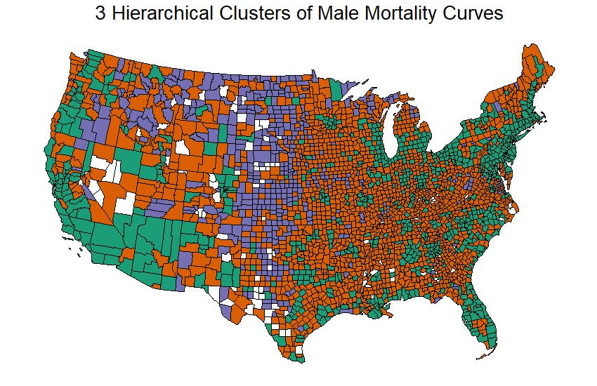
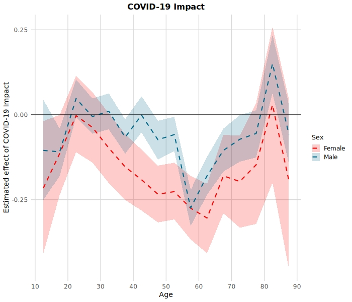
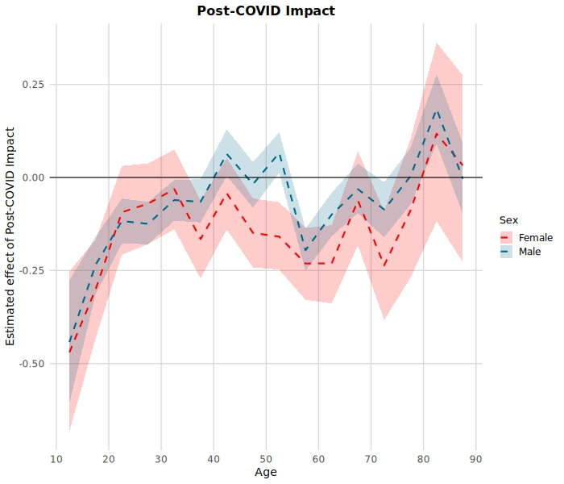
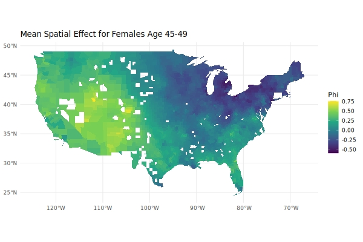

# Spatial Mortality — Bayesian CAR Models & Post-COVID Dynamics

This repo collects figures and references from ongoing projects on **county-level U.S. mortality**, including:
- Bayesian **spatio-temporal** modeling with CAR priors,
- Post-COVID and “after-COVID” effects by **age × sex**,
- Spatial clustering and **baseline risk**,
- Demographic context (e.g., changing racial composition).

Methods and full results are detailed in the peer-reviewed papers below:  
•  *Spatio-Temporal Mortality Modeling for the United States: A Hierarchical Bayesian Approach.* **Risks, 8(4), 117.** [MDPI link](https://www.mdpi.com/2227-9091/8/4/117)  
•  *A Multivariate Spatio-Temporal Model for County-Level Mortality Data in the Contiguous United States.* **Annals of Actuarial Science.** [Cambridge University Press link](https://www.cambridge.org/core/journals/annals-of-actuarial-science/article/multivariate-spatiotemporal-model-for-countylevel-mortality-data-in-the-contiguous-united-states/96BF901C0B6ADE8F434D404653B665C2)  
• *Cluster Leve Mortality Curves in the Continental United States* **North American Actuarial Journal** [Taylor & Francis link](https://www.tandfonline.com/doi/abs/10.1080/10920277.2025.2463933)
•  *Quantifying the Effects of Mental Health on U.S. Suicide and Mortality Rates* **In Progress** 

## Highlights

### 1) Regional patterns in male mortality curves

We clustered mortality curves in the U.S. by county. We discovered that mortality models with only 3 clusters, which are roughly urban, rural, and ultra-rural, performs better for forecasting mortality than doing a state-level model. Our 3 cluster-model outperformed a 48 cluster model by using intelligent clustering. 

This figure shows the 3 clusters we derived using heriarchical clustering on the coefficients of county level splines regression models of mortality. 

---

### 2) COVID vs. Post-COVID shifts by age & sex
We built models to exam suicide rates by county over time to examine what factors affect trends over time. By being careful with data and using effective modeling, we discovered that the Covid-19 lockdown actually deceased suicides for many age groups, including the youngest age groups where suicides had been increasing rapidly prior to the Covid -19 lockdown. 

  
  

**What it shows:** estimated **coefficients** for COVID (2020–2021) and **after-COVID** (2022–2023) by age and sex. In the paper, COVID effects shrink once post-COVID is included, and patterns differ by sex/age. 

---

### 3) Spatial baseline risk

We can exmaine regions with elevated levels of suicide risk. We confirmed existing literature by isolating the regional effect and observing a "suicide belt" where the mid-west has elevated rates of suicide for otherwise similar regions across the U.S.

**What it shows:** posterior mean of **$\phi$** (county-level baseline deviation) for a female age band. Note the broad corridor of elevated risk across the Mountain West and northern Plains—consistent with a “belt” seen in suicide literatures and our own spatial random-effect maps.

---

### Other discoveries

We found a number of other relationships currently being explored, such as:
1) Differences in socio-economic indicators such as house price on mortality between males and females,
2) The effect of race of mortality, even in areas with similar levels of healthcare access mortality rates are much higher in regions with a lower percentage of whites
3) Regional variation in the effects, e.g. in California, counties with higher unemployment have lower mortality whereas in the rest of the country higher unemployment has higher mortality. 

## Modeling (brief)

We model deaths with a **binomial likelihood** and a **logit** link:
\[
\logit(\theta_{kt}) = \mathbf{x}_{kt}^\top \beta + \psi_{kt},\quad 
\psi_{kt} = \phi_k + (\alpha + \delta_k)\cdot \tfrac{t - \bar t}{T}
\]
with **CAR priors** on the spatial intercept $\phi$ and county-specific slope deviations $\delta$, plus weakly-informative priors on fixed effects. This supports **spatial smoothing** and **time-trend pooling** across neighboring counties. (Full details, priors, and estimation notes—including CARBayesST implementation—are in the papers.) 

We examine two families of questions:

1) **Socio-economic models of suicide (2010–2023):** BA%, HPI, marriage rate, household size, %White, poor mental health days, etc., with COVID and after-COVID indicators. See the covariate table and results figures. :contentReference[oaicite:6]{index=6}  
2) **Mental-health indicators vs outcomes:** MHA **positive screen rates** (depression, suicidal ideation, PTSD, psychosis risk) paired with **all-cause** and **suicide** outcomes, stratified by age × sex. :contentReference[oaicite:7]{index=7}

---

## Contact

**Robert Richardson, PhD, ASA**  
[LinkedIn](https://www.linkedin.com/in/robert-richardson-a0597a174/) · [Email](mailto:richardson@stat.byu.edu)
