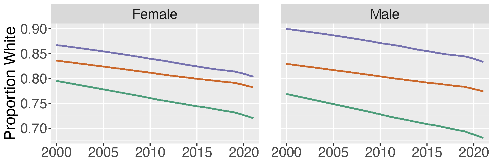

# Spatial Mortality — Bayesian CAR Models & Post-COVID Dynamics

This repo collects figures and references from ongoing projects on **county-level U.S. mortality**, including:
- Bayesian **spatio-temporal** modeling with CAR priors,
- Post-COVID and “after-COVID” effects by **age × sex**,
- Spatial clustering and **baseline risk**,
- Demographic context (e.g., changing racial composition).

Methods and full results are detailed in the peer-reviewed papers below:  
•  *Spatio-Temporal Mortality Modeling for the United States: A Hierarchical Bayesian Approach.* **Risks, 8(4), 117.** [MDPI link](https://www.mdpi.com/2227-9091/8/4/117)  
•  *A Multivariate Spatio-Temporal Model for County-Level Mortality Data in the Contiguous United States.* **Annals of Actuarial Science.** [Cambridge University Press link](https://www.cambridge.org/core/journals/annals-of-actuarial-science/article/multivariate-spatiotemporal-model-for-countylevel-mortality-data-in-the-contiguous-united-states/96BF901C0B6ADE8F434D404653B665C2)  
• *Cluster Leve Mortality Curves in the Continental United States* **North American Actuarial Journal** [Taylor & Francis link](https://www.tandfonline.com/doi/abs/10.1080/10920277.2025.2463933)
•  *Quantifying the Effects of Mental Health on U.S. Suicide and Mortality Rates* **In Progress** 

## Highlights

### 1) Regional patterns in male mortality curves

**What it shows:** a data-driven clustering of **male mortality curve shapes** across counties, revealing broad west/central vs east patterning and local anomalies.  
**Takeaway:** strong geography remains after adjusting for age effects; this motivates spatial pooling and CAR structure in the hierarchical model. (Modeling approach described in the paper’s methods section.) :contentReference[oaicite:1]{index=1}

---

### 2) COVID vs. Post-COVID shifts by age & sex

  
  

**What it shows:** estimated **coefficients** for COVID (2020–2021) and **after-COVID** (2022–2023) by age and sex. In the paper, COVID effects shrink once post-COVID is included, and patterns differ by sex/age. See the discussion around the COVID indicators and Figures 6–7 in the manuscript. :contentReference[oaicite:2]{index=2}

---

### 3) Spatial baseline risk (ϕ): example stratum

**What it shows:** posterior mean of **ϕ** (county-level baseline deviation) for a female age band. Note the broad corridor of elevated risk across the Mountain West and northern Plains—consistent with a “belt” seen in suicide literatures and our own spatial random-effect maps (see mapping figures and discussion). :contentReference[oaicite:3]{index=3}

---

### 4) Demographic drift: proportion white by sex over time

**What it shows:** declining **proportion white** over 2000–2020 in both sexes, with different baselines by panel. Useful as a context plot for demographic composition changes referenced in the covariate section. (Derived from RaceRaw; see figure panels.) :contentReference[oaicite:4]{index=4}

---

## Modeling (brief)

We model deaths with a **binomial likelihood** and a **logit** link:
$$
\logit(\theta_{kt}) = \mathbf{x}_{kt}^\top \beta + \psi_{kt},\quad 
\psi_{kt} = \phi_k + (\alpha + \delta_k)\cdot \tfrac{t - \bar t}{T}
$$
with **CAR priors** on the spatial intercept $\phi$ and county-specific slope deviations $\delta$, plus weakly-informative priors on fixed effects. This supports **spatial smoothing** and **time-trend pooling** across neighboring counties. (Full details, priors, and estimation notes—including CARBayesST implementation—are in the papers.) 

We examine two families of questions:

1) **Socio-economic models of suicide (2010–2023):** BA%, HPI, marriage rate, household size, %White, poor mental health days, etc., with COVID and after-COVID indicators. See the covariate table and results figures. :contentReference[oaicite:6]{index=6}  
2) **Mental-health indicators vs outcomes:** MHA **positive screen rates** (depression, suicidal ideation, PTSD, psychosis risk) paired with **all-cause** and **suicide** outcomes, stratified by age × sex. :contentReference[oaicite:7]{index=7}

---

## Contact

**Robert Richardson, PhD, ASA**  
[LinkedIn](https://www.linkedin.com/in/robert-richardson-a0597a174/) · [Email](mailto:richardson@stat.byu.edu)
